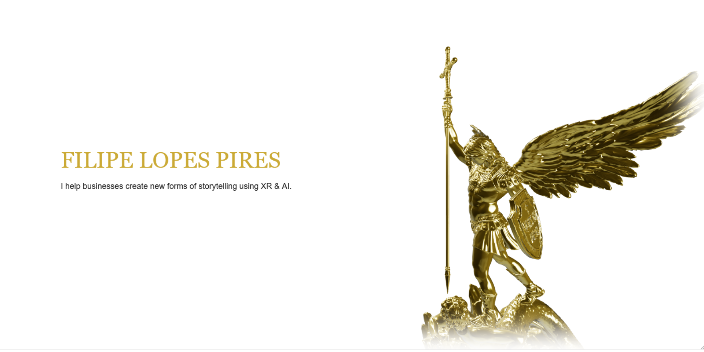

<a href="https://www.filipelopespires.com/" target="_blank" rel="noopener noreferrer" style="display: block;">
  <picture>
    <source media="(prefers-color-scheme: dark)" srcset="media/Banner_Dark.png" />
    
  </picture>
</a>

 <!-- light theme #CBAA36 dark theme #0D0D0D -->

### About Me

Lead immersive engineer of [Creative Tech](https://github.com/CTDorier) at [Dorier](https://dorier-group.com/), part of [MCI Group](https://www.mci-group.com/).

Previously working on holograms and spatial video at [Arcturus](https://arcturus.studio/). <!-- https://github.com/Arcturus-Studio -->
Member of the [XR4Europe](https://xr4europe.eu/), [Euromersive](https://www.euromersive.eu/) and [XR Guild](https://www.xrguild.org/) initiatives, uniting the XR community in Europe and across the globe.

Master's degree in Informatics Engineering from [DETI](https://github.com/detiuaveiro), [University of Aveiro](https://www.ua.pt/en/deti).

<!--
### Fun Profile Trophies

-->
